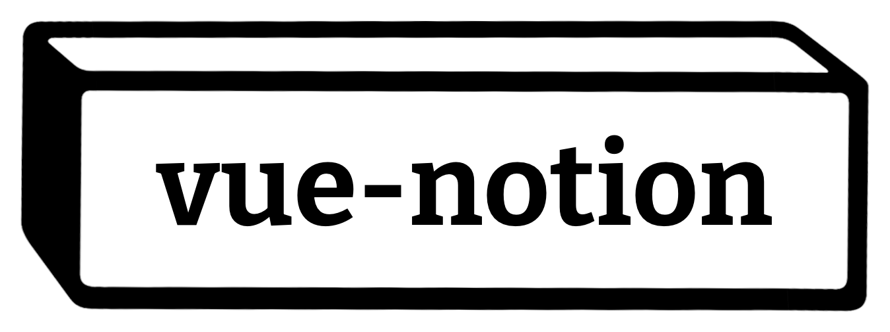

<div align="center">
  
  <p>An unofficial Notion renderer</p>
</div>

<h3 align="center">
  <a href="#features">Features</a>
  <span> · </span>
  <a href="#install">Install</a>
  <span> · </span>
  <a href="#how-to">How To</a>
  <span> · </span>
  <a href="#credits">Credits</a>
</h3>

<p align="center">
  <a href="https://www.npmjs.org/package/vue-notion">
    
  </a>
  <a href="https://npmcharts.com/compare/vue-notion?minimal=true">
    
  </a>
  <a href="https://github.com/janniks/vue-notion/blob/master/LICENSE">
    
  </a>
  <a href="https://twitter.com/intent/follow?screen_name=jnnksbrt">
    
  </a>
</p>

---

A Vue renderer for Notion pages.
Use Notion as CMS for your blog, documentation or personal site.

> `vue-notion` was ported to Vue from [`react-notion`](https://github.com/splitbee/react-notion) (developed by [Splitbee 🐝](https://splitbee.io/) – a fast, reliable, free, and modern analytics for any team)

> This packages doesn't handle the communication with the API. Check out [notion-api-worker](https://github.com/splitbee/notion-api-worker) from [Splitbee](https://splitbee.io/) for an easy solution.

<sub>Created by <a href="https://twitter.com/jnnksbrt">Jannik Siebert</a></sub>

## Features

🎯 **Accurate** – Results are _almost_ identical

🎨 **Custom Styles** – Styles are easily adaptable. Optional styles included

_coming soon_ 🔮 **Code Highlighting** – Automatic code highlighting with [prismjs](https://prismjs.com/)

_coming soon_ 🌎 **SSR / Static Generation Support** – Functions to work with Nuxt and other frameworks

## Install

```bash
npm install vue-notion
```

## How To

### Minimal Example

We can store the API response in a `.json` file and import it.

```vue
<template>
  <NotionRenderer :blockMap="blockMap" />
</template>

<script>
import { NotionRenderer } from "vue-notion";
import response from "./load-page-chunk-response.json"; // https://www.notion.so/api/v3/loadPageChunk
const blockMap = response.recordMap.block;

export default {
  components: {
    NotionRenderer,
  },
  data() {
    return { blockMap };
  },
};
</script>
```

A working example using Nuxt can be found inside the `example` directory.

## Sites using vue-notion

List of pages that are using this library.

- [StorePreviewer](https://www.storepreviewer.com)
- _...if you're using `vue-notion`, we'd be happy to feature you here_

## Supported Blocks

Most common block types are supported. We happily accept pull requests to add support for the missing blocks.

| Block Type        | Supported      | Notes                  |
| ----------------- | -------------- | ---------------------- |
| Text              | ✅ Yes         |                        |
| Heading           | ✅ Yes         |                        |
| Image             | ✅ Yes         |                        |
| Image Caption     | ✅ Yes         |                        |
| Bulleted List     | ✅ Soon        |                        |
| Numbered List     | ✅ Soon        |                        |
| Quote             | ✅ Soon        |                        |
| Callout           | ✅ Yes         |                        |
| Column            | ✅ Yes         |                        |
| iframe            | ✅ Soon        |                        |
| Video             | ✅ Soon        | Only embedded videos   |
| Divider           | ✅ Soon        |                        |
| Link              | ✅ Yes         |                        |
| Code              | ✅ Soon        | Highlighting coming    |
| Web Bookmark      | ✅ Soon        |                        |
| Toggle List       | ✅ Soon        |                        |
| Page Links        | ✅ Yes         |                        |
| Header            | ✅ Yes         | Enable with `fullPage` |
| Databases         | ❌ Not planned |                        |
| Checkbox          | ❌ Not planned |                        |
| Table Of Contents | ❌ Not planned |                        |

## Credits

- [Jannik Siebert](https://twitter.com/jnnksbrt) –
- [Tobias Lins](https://tobi.sh) – react-notion Idea, Code
- [Timo Lins](https://timo.sh) – react-notion Code, Documentation
- [samwightt](https://github.com/samwightt) – react-notion Inspiration & API Typings
- [vue-notion Contributors 💕](https://github.com/janniks/vue-notion/graphs/contributors)
- [react-notion Contributors 💕](https://github.com/splitbee/react-notion/graphs/contributors)
